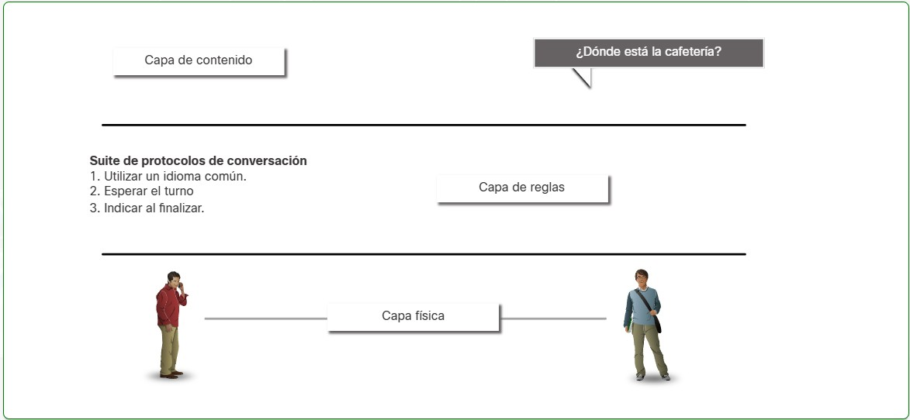
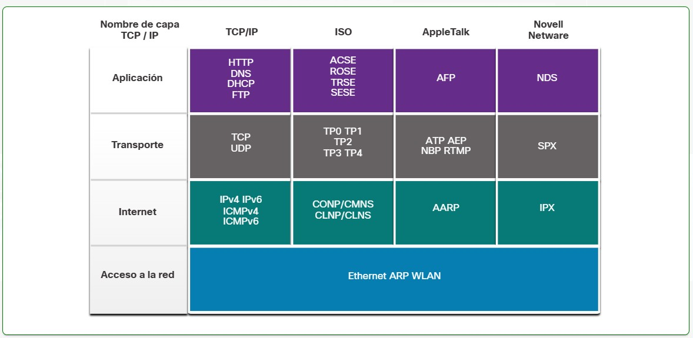
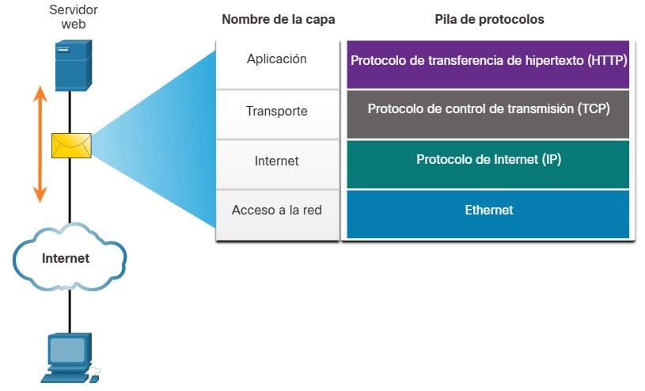
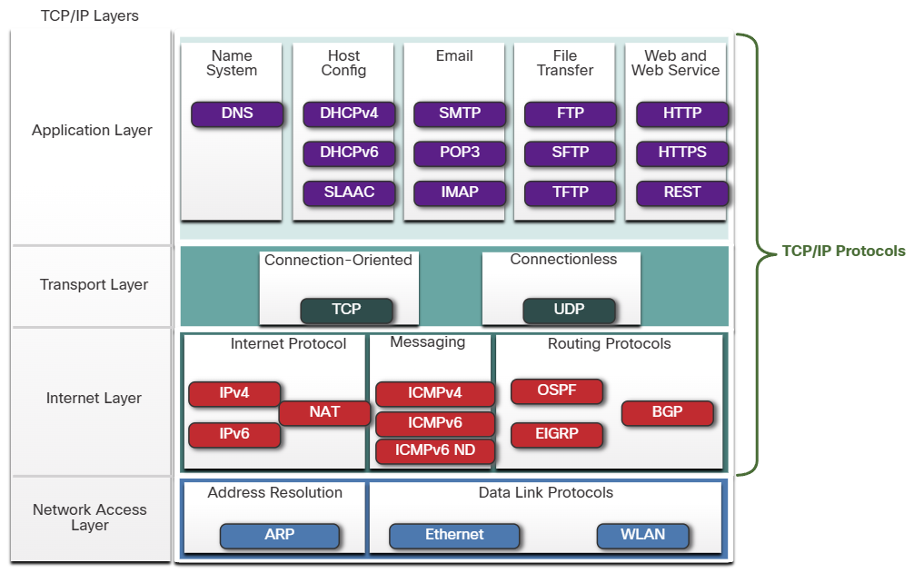

## 3.3.1 Conjuntos de protocolos de red

En muchos casos, los protocolos deben poder trabajar con otros protocolos para que su experiencia en línea le proporcione todo lo que necesita para las comunicaciones de red. Los conjuntos de protocolos están diseñados para funcionar entre sí sin problemas.

Un grupo de protocolos interrelacionados que son necesarios para realizar una función de comunicación se denomina **suite de protocolos**.

Una de las mejores formas para visualizar el modo en que los protocolos interactúan dentro de una suite es ver la interacción como una pila. Una **pila de protocolos** muestra la forma en que los protocolos individuales se implementan dentro de una suite. Los protocolos se muestran en capas, donde cada servicio de nivel superior depende de la funcionalidad definida por los protocolos que se muestran en los niveles inferiores. Las capas inferiores de la pila se encargan del movimiento de datos por la red y proporcionan servicios a las capas superiores, las cuales se enfocan en el contenido del mensaje que se va a enviar.

Como se muestra en la figura, podemos utilizar capas para describir la actividad que tiene lugar en el ejemplo de comunicación cara a cara. En la capa inferior, la capa física, hay dos personas, cada una con una voz que puede pronunciar palabras en voz alta. En el medio está la capa de reglas que estipula los requisitos de comunicación incluyendo que se debe elegir un lenguaje común. En la parte superior está la capa de contenido y aquí es donde se habla realmente el contenido de la comunicación.

*Las suites de protocolos son conjuntos de reglas que funcionan conjuntamente para ayudar a resolver un problema.*

## 3.3.2 Evolución de los conjuntos de protocolos

Una suite de protocolos es un grupo de protocolos que trabajan en forma conjunta para proporcionar servicios integrales de comunicación de red. Desde la década de 1970 ha habido varios conjuntos de protocolos diferentes, algunos desarrollados por una organización de estándares y otros desarrollados por varios proveedores.

Durante la evolución de las comunicaciones de red e Internet hubo varios conjuntos de protocolos competidores, como se muestra en la figura.

* _**Internet Protocol Suite o TCP/IP** - Este es el conjunto de protocolos más común y relevante que se utiliza hoy en día. El conjunto de protocolos TCP/IP es un conjunto de protocolos estándar abierto mantenido por Internet Engineering Task Force (IETF)._
* _**Protocolos de interconexión de sistemas abiertos (OSI)** - Esta es una familia de protocolos desarrollados conjuntamente en 1977 por la Organización Internacional de Normalización (ISO) y la Unión Internacional de Telecomunicaciones (UIT). El protocolo OSI también incluía un modelo de siete capas llamado modelo de referencia OSI. El modelo de referencia OSI categoriza las funciones de sus protocolos. Hoy OSI es conocido principalmente por su modelo en capas. Los protocolos OSI han sido reemplazados en gran medida por TCP/IP._
* _**AppleTalk** - Un paquete de protocolos propietario de corta duración lanzado por Apple Inc. en 1985 para dispositivos Apple. En 1995, Apple adoptó TCP/IP para reemplazar AppleTalk._
* _**Novell NetWare** - Un conjunto de protocolos propietarios de corta duración y sistema operativo de red desarrollado por Novell Inc. en 1983 utilizando el protocolo de red IPX. En 1995, Novell adoptó TCP/IP para reemplazar a IPX._

## 3.3.3 Ejemplo de protocolo TCP/IP

Los protocolos TCP/IP son específicos de las capas Aplicación, Transporte e Internet. No hay protocolos TCP/IP en la capa de acceso a la red. Los protocolos LAN de capa de acceso a la red más comunes son los protocolos Ethernet y WLAN (LAN inalámbrica). Los protocolos de la capa de acceso a la red son responsables de la entrega de los paquetes IP en los medios físicos.
La figura muestra un ejemplo de los tres protocolos TCP/IP utilizados para enviar paquetes entre el navegador web de un host y el servidor web. HTTP, TCP e IP son los protocolos TCP/IP utilizados. En la capa de acceso a la red, Ethernet se utiliza en el ejemplo. Sin embargo, esto también podría ser un estándar inalámbrico como WLAN o servicio celular.

## 3.3.4 Conjunto de TCP/IP

Hoy en día, el conjunto de protocolos TCP/IP incluye muchos protocolos y continúa evolucionando para admitir nuevos servicios. Algunos de los más populares se muestran en la figura.

*_TCP/IP es el conjunto de protocolos utilizado por Internet y las redes de hoy. TCP/IP tiene dos aspectos importantes para proveedores y fabricantes:_*
*Suite de protocolo estándar abierto*- *Esto significa que está disponible gratuitamente para el público y puede ser utilizado por cualquier proveedor en su hardware o en su software.*
*Suite de protocolo basado en estándares*-*Esto significa que ha sido respaldado por la industria de redes y aprobado por una organización de estándares. Esto asegura que productos de distintos fabricantes puedan interoperar correctamente.*

**Capa de aplicación**

*Sistema de nombres*

* **DNS** - *Domain Name System*. Traduce los nombres de dominio tales como cisco.com a direcciones IP
*Configuración de host*

* **DHCPv4** - *Protocolo de configuración dinámica de host para IPv4*. Un servidor DHCPv4 asigna dinámicamente información de direccionamiento IPv4 a clientes DHCPv4 al inicio y permite que las direcciones se reutilicen cuando ya no sean necesarias.
* **DHCPv6** - *Protocolo de configuración dinámica de host para IPv6*. DHCPv6 es similar a DHCPv4. Un servidor DHCPv6 asigna dinámicamente información de direccionamiento IPv6 a clientes DHCPv6 al inicio.
* **SLAAC** - *Autoconfiguración sin estado*. Método que permite a un dispositivo obtener su información de direccionamiento IPv6 sin utilizar un servidor DHCPv6.
*Correo electrónico*

* **SMTP** - *Protocolo para Transferencia Simple de Correo*. Les permite a los clientes enviar correo electrónico a un servidor de correo y les permite a los servidores enviar correo electrónico a otros servidores.
* **POP3** -*Protocolo de Oficina de Correo versión 3*. Permite a los clientes recuperar el correo electrónico de un servidor de correo y descargarlo en la aplicación de correo local del cliente.
* **IMAP** - *Protocolo de Acceso a Mensajes de Internet* Permite que los clientes accedan a correos electrónicos almacenados en un servidor de correo.
*Transferencia de Archivos*

* **FTP** - *Protocolo de Transferencia de Archivos*. Establece las reglas que permiten a un usuario en un host acceder y transferir archivos hacia y desde otro host a través de una red. FTP Es un protocolo confiable de entrega de archivos, orientado a la conexión y con acuse de recibo.
* **SFTP** - *SSH Protocolo de Transferencia de Archivos* Como una extensión al protocolo Shell seguro (SSH), el SFTP se puede utilizar para establecer una sesión segura de transferencia de archivos, en el que el archivo transferido está cifrado. SSH es un método para el inicio de sesión remoto seguro que se utiliza normalmente para acceder a la línea de comandos de un dispositivo.
* **TFTP** - *Protocolo de Transferencia de Archivos Trivial* Un protocolo de transferencia de archivos simple y sin conexión con la entrega de archivos sin reconocimiento y el mejor esfuerzo posible. Utiliza menos sobrecarga que FTP.
*Web y Servicio Web*

* **HTTP** - *Hypertext Transfer Protocol*. Un Conjunto de reglas para intercambiar texto, imágenes gráficas, sonido, video y otros archivos multimedia en la World Wide Web.
* **HTTPS** - *HTTP seguro*. Una forma segura de HTTP que cifra los datos que se intercambian a través de la World Wide Web.
* **REST** - *Transferencia de Estado Representacional*. Servicio web que utiliza interfaces de programación de aplicaciones (API) y solicitudes HTTP para crear aplicaciones web.

**Capa de transporte**
*Orientado a la conexión*

* **TCP** - *Protocolo de Control de Transmisión*. Permite la comunicación confiable entre procesos que se ejecutan en hosts independientes y tiene transmisiones fiables y con acuse de recibo que confirman la entrega exitosa.
*Sin conexión*

* **UDP** - *Protocolo de Datagramas de Usuario* Habilita un proceso que se ejecuta en un host para enviar paquetes a un proceso que se ejecuta en otro host Sin embargo, UDP No confirma la transmisión correcta de datagramas

**Capa de Internet**
*Protocolo de Internet*

* **IPv4** - *Protocolo de Internet versión 4*. Recibe segmentos de mensajes de la capa de transporte, empaqueta mensajes en paquetes y dirige paquetes para entrega end-to-end a través de una red. IPv4 utiliza una dirección de 32 bits.
* **IPv6** - *IP versión 6*. Similar a IPv4 pero usa una dirección de 128 bits.
* **NAT** - *Traducción de Direcciones de Red* Traduce las direcciones IPv4 de una red privada en direcciones IPv4 públicas globalmente únicas.
*Mensajería*

* **ICMPv4** - *Protocolo de Control de Mensajes de Internet* Proporciona comentarios desde un host de destino a un host de origen con respecto a los errores en la entrega de paquetes
* **ICMPv6** - *ICMP para IPv6*. Funcionalidad similar a ICMPv4 pero se utiliza para paquetes IPv6.
* **ICMPv6 ND** - *Protocolo de Descubrimiento de Vecinos versión 6* Incluye cuatro mensajes de protocolo que se utilizan para la resolución de direcciones y la detección de direcciones duplicadas.
*Protocolos de Routing*

* **OSPF** - *Abrir el Camino más Corto Primero*. Protocolo de enrutamiento de estado de vínculo que utiliza un diseño jerárquico basado en áreas. OSPF s un protocolo de routing interior de estándar abierto.
* **EIGRP** - *EIGRP Protocolo de Enrutamiento de Puerta de enlace Interior Mejorado*. Es un protocolo de routing abierto desarrollado por Cisco, utiliza una métrica compuesta en función del ancho de banda, la demora, la carga y la confiabilidad.
* **BGP** - *Protocolo de Puerta de Enlace de Frontera* Un protocolo de enrutamiento de puerta de enlace exterior estándar abierto utilizado entre los proveedores de servicios de Internet (ISP). BGP también se utiliza entre los ISP y sus clientes privados más grandes para intercambiar información de enrutamiento.

**Capa de Acceso de Red**
*Resolución de dirección*

* **ARP** - *Protocolo de Resolución de Direcciones* Proporciona la asignación de direcciones dinámicas entre una dirección IP y una dirección de hardware.
*Nota:* Puede ver otro estado de documentación que ARP opera en la capa de Internet (OSI Capa 3). Sin embargo, en este curso declaramos que ARP opera en la capa de acceso a la red (OSI Capa 2) porque su objetivo principal es descubrir la dirección MAC del destino. y una dirección de capa 2 es una dirección MAC.
*Protocolos de Enlace de Datos:*

* **Ethernet** - define las reglas para conectar y señalizar estándares de la capa de acceso a la red.
* **WLAN** - *Wireless Local Area Network*. Define las reglas para la señalización inalámbrica a través de las frecuencias de radio de 2,4 GHz y 5 GHz.

## 3.3.5 Proceso de comunicación TCP/IP

La animación en las figuras demuestra el proceso de comunicación completo mediante un ejemplo de servidor web que transmite datos a un cliente.
En la figura se ve el proceso de encapsulamiento cuando un servidor web envía una página web a un cliente web.

    

Animación del cliente que recibe y desencapsula la página Web para mostrarla en el explorador Web.

## 3.3.6 Verifique su compresión - - Protocolos

Verifique su comprensión de los conjuntos de protocolos eligiendo la MEJOR respuesta a las siguientes preguntas.

**Pregunta 1**
UDP y TCP pertenecen a qué capa del protocolo TCP/IP?

* [ ] Aplicación
* [x] Transporte
* [ ] Internet
* [ ] Acceso a la red

**Pregunta 2**
¿Cuáles dos protocolos pertenecen a la capa de aplicación del modelo TCP/IP?

* [ ] EIGRP
* [X] Envenenamiento _(Esto esta mal traducido es **DNS**)._
* [ ] Funciones
* [ ] ICMP
* [x] DHCP

**Pregunta 3**
¿Cuál protocolo opera en la capa de acceso del modelo TCP/IP?

* [ ] HTTP
* [ ] IP
* [ ] DNS
* [x] Ethernet

**Pregunta 4**
¿Cuáles de los siguientes son protocolos que proporcionan comentarios desde el host de destino al host de origen en relación con errores en la entrega de paquetes? (Escoja dos opciones.)

* [ ] IPv4
* [ ] TCP
* [x] ICMPv4
* [ ] IPv6
* [ ] UDP
* [x] ICMPv6

**Pregunta 5**
Un dispositivo recibe un marco de enlace de datos con datos y procesos y elimina la información de Ethernet. ¿Qué información sería la siguiente en ser procesada por el dispositivo receptor?

* [ ] HTTP funciona en la capa de aplicación.
* [ ] HTML en la capa de aplicación
* [x] IP funciona en la capa de Internet. *(Después de procesar la capa de Acceso a la Red (Ethernet), la siguiente capa en la pila TCP/IP es la capa de Internet (IP).)*
* [ ] UDP funciona en la capa de Internet.
* [ ] TCP funciona en la capa de transporte.

**Pregunta 6**
¿Qué servicios proporciona la capa de Internet del conjunto de protocolos TCP/IP? (Escoja tres opciones.)

* [ ] Transferencia de archivos
* [ ] Resolución de dirección *(Aunque ARP está relacionado con la capa de Internet, el texto lo coloca en la capa de Acceso a la Red. La capa de Internet se enfoca en el enrutamiento y direccionamiento a nivel de red global).*
* [x] Protocolos de routing
* [x] Mensajería
* [ ] Ethernet
* [x] Protocolo de Internet *(IPv4/IPv6 son los protocolos principales de esta capa que manejan el direccionamiento y entrega de extremo a extremo).*
