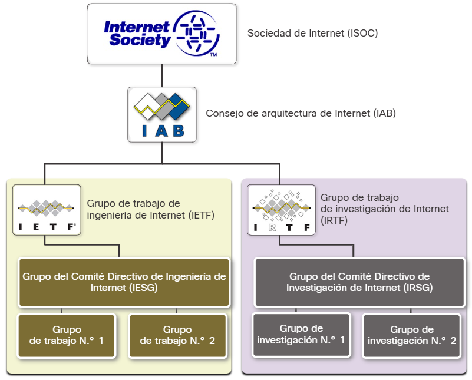
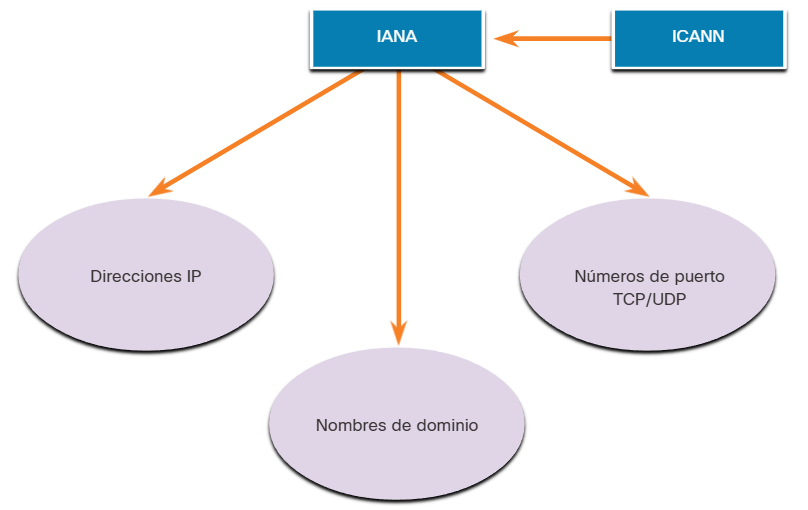

## 3.4.1 Estándares abiertos

Al comprar neumáticos nuevos para un automóvil, hay muchos fabricantes que puede elegir. Cada uno de ellos tendrá al menos un tipo de neumático que se adapte a su coche. Esto se debe a que la industria automotriz utiliza estándares cuando se producen automóviles. Es lo mismo con los protocolos. Debido a que hay muchos fabricantes diferentes de componentes de red, todos deben usar los mismos estándares. En el establecimiento de redes, las normas son elaboradas por organizaciones internacionales de normalización.

Los **estándares abiertos** fomentan la interoperabilidad, la competencia y la innovación. También garantizan que ningún producto de una sola empresa pueda monopolizar el mercado o tener una ventaja desleal sobre la competencia.

La compra de un router inalámbrico para el hogar constituye un buen ejemplo de esto. Existen muchas opciones distintas disponibles de diversos proveedores, y todas ellas incorporan protocolos estándares, como IPv4, DHCP, 802.3 (Ethernet) y 802.11 (LAN inalámbrica). Estos estándares abiertos también permiten que un cliente con el sistema operativo OS X de Apple descargue una página web de un servidor web con el sistema operativo Linux. Esto se debe a que ambos sistemas operativos implementan los protocolos de estándar abierto, como los de la suite TCP/IP.

Las organizaciones de estandarización generalmente son organizaciones sin fines de lucro y neutrales en lo que respecta a proveedores, que se establecen para desarrollar y promover el concepto de estándares abiertos. Las organizaciones de estandarización son importantes para mantener una Internet abierta con especificaciones y protocolos de libre acceso que pueda implementar cualquier proveedor.

Las organizaciones de estandarización pueden elaborar un conjunto de reglas en forma totalmente independiente o, en otros casos, pueden seleccionar un protocolo exclusivo como base para el estándar. Si se utiliza un protocolo exclusivo, suele participar el proveedor que creó el protocolo.

* IEEE
* IETF
* IANA
* TIA
* ICANN
* ITU

## 3.4.2 Estándares de Internet

Distintas organizaciones tienen diferentes responsabilidades para promover y elaborar estándares para el protocolo TCP/IP.

La figura muestra las organizaciones de estándares involucradas con el desarrollo y soporte de Internet.

*Sociedad de Internet (ISOC)* - *es responsable de promover el desarrollo, la evolución y el uso abiertos de Internet en todo el mundo.*
*Consejo de Arquitectura de Internet (IAB)* - *es responsable de la administración y el desarrollo general de los estándares de Internet.*
*Grupo de trabajo de ingeniería de Internet (IEFT)* - *desarrolla, actualiza y mantiene las tecnologías de Internet y de TCP/IP. Esto incluye el proceso y documentación para el desarrollo de nuevos protocolos y la actualización de los protocolos existentes, conocidos como documentos de petición de comentarios (RFC).*
*Grupo de trabajo de investigación de Internet (IRTF)* - *está enfocado en la investigación a largo plazo en relación con los protocolos de Internet y TCO/IP, como los grupos Anti-Spam Research Group (ASRG), Crypto Forum Research Group (CFRG) y Peer-to-Peer Research Group (P2PRG).*

La siguiente figura muestra las organizaciones de estándares involucradas en el desarrollo y soporte de TCP/IP e incluyen IANA e ICANN.

*Corporación de Internet para la Asignación de Nombres y Números (ICANN)* - *con base en los Estados Unidos, coordina la asignación de direcciones IP, la administración de nombres de dominio y la asignación de otra información utilizada por los protocolos TCP/IP.*
*Autoridad de Números Asignados de Internet (IANA)* - *responsable de supervisar y administrar la asignación de direcciones IP, la administración de nombres de dominio y los identificadores de protocolo para ICANN.*

## 3.4.3 Organizaciones de estándares para comunicaciones y electrónica

Otras organizaciones de estandarización tienen responsabilidades de promoción y creación de estándares de comunicación y electrónica que se utilizan en la entrega de paquetes IP como señales electrónicas en medios inalámbricos o por cable.

Estas organizaciones estándar incluyen las siguientes:

* **Institute of Electrical and Electronics Engineers (IEEE, pronounced “I-triple-E”):** organización de electrónica e ingeniería eléctrica dedicada a avanzar en innovación tecnológica y a elaborar estándares en una amplia gama de sectores, que incluyen energía, servicios de salud, telecomunicaciones y redes. Los estándares importantes de red IEEE incluyen 802.3 Ethernet y 802.11 WLAN. Busque en Internet otros estándares de red IEEE.
* **Asociación de Industrias Electrónicas (EIA):** es conocida principalmente por sus estándares relacionados con el cableado eléctrico, los conectores y los racks de 19 in que se utilizan para montar equipos de red.
* **Asociación de las Industrias de las Telecomunicaciones (TIA):** es responsable de desarrollar estándares de comunicación en diversas áreas, entre las que se incluyen equipos de radio, torres de telefonía móvil, dispositivos de voz sobre IP (VoIP), comunicaciones satelitales y más. La figura muestra un ejemplo de un cable Ethernet certificado que fue desarrollado cooperativamente por la TIA y la EIA.
* **Sector de Normalización de las Telecomunicaciones de la Unión Internacional de Telecomunicaciones (UIT-T):** es uno de los organismos de estandarización de comunicación más grandes y más antiguos. El UIT-T define estándares para la compresión de vídeos, televisión de protocolo de Internet (IPTV) y comunicaciones de banda ancha, como la línea de suscriptor digital (DSL).

*(Se omite la sección 3.4.4 según lo solicitado)*

## 3.4.5 Compruebe su comprensión - Organizaciones de Estándares

Verifique su comprensión de las organizaciones de estándares eligiendo la MEJOR respuesta a las siguientes preguntas.

**Pregunta 1**
Verdadero o falso Las organizaciones de normas suelen ser neutrales con el proveedor.

* [x] Verdadero
* [ ] Falso

**Pregunta 2**
Esta organización de normas se ocupa de los documentos de solicitud de comentarios (RFC) que especifican nuevos protocolos y actualizan los existentes.

* [ ] Sociedad de Internet (ISOC)
* [x] Grupo de trabajo de ingeniería de Internet (IETF)
* [ ] Consejo de Arquitectura de Internet (IAB)
* [ ] Grupo de trabajo de investigación de Internet (IRTF)

**Pregunta 3**
Esta organización es responsable de controlar y administrar la asignación de direcciones IP, la administración de nombres de dominio y los identificadores de protocolo.

* [ ] Sociedad de Internet (ISOC)
* [ ] Grupo de trabajo de ingeniería de Internet (IETF)
* [ ] Consejo de Arquitectura de Internet (IAB)
* [x] Autoridad de números asignados de Internet (IANA)

**Pregunta 4**
¿Qué tipos de estándares están desarrollados por Electronics Industries Alliance (EIA)?

* [x] Cableado eléctrico y conectores
* [ ] Equipos de radio y torres de telefonía celular
* [ ] Compresión de vídeo y comunicaciones de banda ancha
* [ ] Voz sobre IP (VoIP) y comunicaciones por satélite