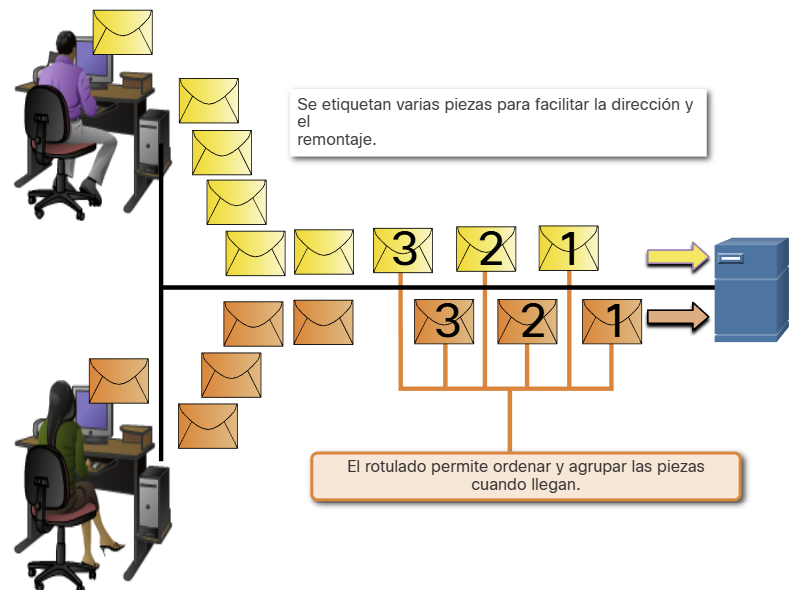
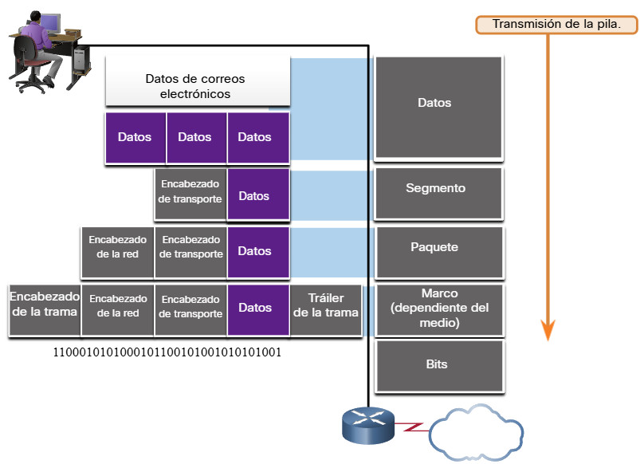
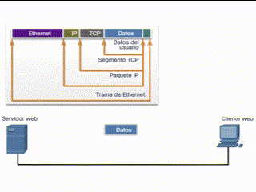
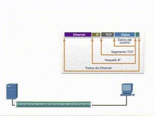

# 3.5.1 Beneficios del uso de un modelo en capas

En realidad no se puede ver que los paquetes reales viajan a través de una red real, la forma en que se pueden ver los componentes de un coche que se ensamblan en una línea de ensamble. Por lo tanto, ayuda tener una forma de pensar acerca de una red para que usted pueda imaginar lo que está sucediendo. Un modelo es útil en estas situaciones.

Conceptos complejos, como el funcionamiento de una red, pueden ser difíciles de explicar y comprender. Por esta razón, un modelo en capas se utiliza para modularizar las operaciones de una red en capas manejables.

Los beneficios por el uso de un modelo en capas para describir protocolos de red y operaciones incluyen lo siguiente:

* Ayuda en el diseño de protocolos, ya que los protocolos que operan en una capa específica tienen información definida según la cual actúan, y una interfaz definida para las capas superiores e inferiores.
* Fomenta la competencia, ya que los productos de distintos proveedores pueden trabajar en conjunto.
* Evita que los cambios en la tecnología o en las funcionalidades de una capa afecten otras capas superiores e inferiores.
* Proporciona un lenguaje común para describir las funciones y capacidades de red.

Como se muestra en la figura, hay dos modelos en capas que se utilizan para describir las operaciones de red:

* Modelo de referencia de interconexión de sistemas abiertos.
* Modelo de referencia TCP/IP


# 3.5.2 El modelo de referencia OSI

El modelo de referencia OSI proporciona una amplia lista de funciones y servicios que se pueden presentar en cada capa. este tipo de modelo es coherente con todos los tipos de servicios y protocolos de red al describir qué es lo que se debe hacer en una capa determinada, pero sin regir la forma en que se debe lograr.

También describe la interacción de cada capa con las capas directamente por encima y por debajo de él. Los protocolos TCP/IP que se analizan en este curso se estructuran en torno a los modelos OSI y TCP/IP. La tabla muestra detalles sobre cada capa del modelo OSI. La funcionalidad de cada capa y la relación entre ellas será más evidente a medida que avance en el curso y que se brinden más detalles acerca de los protocolos.

| Capa del modelo OSI | Descripción |
|---------------------|-------------|
| 7 - Aplicación      | Contiene protocolos utilizados para comunicaciones proceso a proceso. |
| 6 - Presentación    | Proporciona una representación común de los datos transferidos entre los servicios de capa de aplicación. |
| 5 - Sesión          | Organiza el diálogo y administra el intercambio de datos entre aplicaciones. |
| 4 - Transporte      | Define servicios para segmentar, transferir y volver a montar los datos para las comunicaciones entre dispositivos. |
| 3 - Red             | Intercambia datos a través de la red entre los dispositivos finales identificados. |
| 2 - Enlace de datos | Describe métodos para intercambiar tramas de datos entre dispositivos a través de un medio común. |
| 1 - Física          | Define los componentes mecánicos, eléctricos y de procedimiento para la transmisión de bits. |

**Nota:** mientras las capas del modelo TCP/IP se mencionan solo por el nombre, las siete capas del modelo OSI se mencionan con frecuencia por número y no por nombre. Por ejemplo, la capa física se conoce como Capa 1 del modelo OSI, la capa de enlace de datos es Layer2, y así sucesivamente.

# 3.5.3 Modelo de protocolo TCP/IP

El modelo de protocolo TCP/IP para comunicaciones de internetwork se creó a principios de la década de los setenta y se conoce con el nombre de modelo de Internet. Este tipo de modelo coincide con precisión con la estructura de una suite de protocolos determinada. El modelo TCP/IP es un protocolo modelo porque describe las funciones que ocurren en cada capa de protocolos dentro de una suite de TCP/IP. TCP/IP también es un ejemplo de un modelo de referencia. La tabla muestra detalles sobre cada capa del modelo OSI.

| Capa del modelo TCP/IP | Descripción |
|------------------------|-------------|
| 4 - Aplicación         | Representa datos para el usuario más el control de codificación y de diálogo. |
| 3 - Transporte         | Admite la comunicación entre distintos dispositivos a través de diversas redes. |
| 2 - Internet           | Determina el mejor camino a través de una red. |
| 1 - Acceso a la red    | Controla los dispositivos del hardware y los medios que forman la red. |

Las definiciones del estándar y los protocolos TCP/IP se explican en un foro público y se definen en un conjunto de documentos de petición de comentarios (RFC) disponibles al público. Un RFC es creado por ingenieros de redes y enviado a otros miembros de IETF para comentarios.

# 3.5.4 Comparación del modelo OSI y el modelo TCP/IP

Los protocolos que forman la suite de protocolos TCP/IP pueden describirse en términos del modelo de referencia OSI. En el modelo OSI, la capa de acceso a la red y la capa de aplicación del modelo TCP/IP están subdivididas para describir funciones discretas que deben producirse en estas capas.

En la capa de acceso a la red, la suite de protocolos TCP/IP no especifica cuáles protocolos utilizar cuando se transmite por un medio físico; solo describe la transferencia desde la capa de Internet a los protocolos de red física. Las capas OSI 1 y 2 tratan los procedimientos necesarios para acceder a los medios y las maneras físicas de enviar datos por la red.


Las similitudes clave se encuentran en la capa de transporte y en la capa de red. Sin embargo, los dos modelos se diferencian en el modo en que se relacionan con las capas que están por encima y por debajo de cada capa.

La capa OSI 3, la capa de red, asigna directamente a la capa de Internet TCP/IP. Esta capa se utiliza para describir protocolos que direccionan y enrutan mensajes a través de una red.

La capa OSI 4, la capa de transporte, asigna directamente a la capa de transporte TCP/IP. Esta capa describe los servicios y las funciones generales que proporcionan la entrega ordenada y confiable de datos entre los hosts de origen y de destino.

La capa de aplicación TCP/IP incluye un número de protocolos que proporciona funcionalidad específica a una variedad de aplicaciones de usuario final. Las capas 5, 6 y 7 del modelo OSI se utilizan como referencias para proveedores y desarrolladores de software de aplicación para fabricar productos que funcionan en redes.

Tanto el modelo TCP/IP como el modelo OSI se utilizan comúnmente en la referencia a protocolos en varias capas. Dado que el modelo OSI separa la capa de enlace de datos de la capa física, se suele utilizan cuando se refiere a esas capas inferiores.

# 3.6.1 Segmentación del mensaje

Conocer el modelo de referencia OSI y el modelo de protocolo TCP/IP será útil cuando aprenda acerca de cómo se encapsulan los datos a medida que se mueven a través de una red. No es tan simple como una carta física que se envía a través del sistema de correo.

En teoría, una comunicación simple, como un vídeo musical o un correo electrónico puede enviarse a través de la red desde un origen hacia un destino como una transmisión de bits masiva y continua. Sin embargo, esto crearía problemas para otros dispositivos que necesitan utilizar los mismos canales de comunicación o enlaces. Estas grandes transmisiones de datos originarán retrasos importantes. Además, si falla un enlace en la infraestructura de la red interconectada durante la transmisión, el mensaje completo se perdería y tendría que retransmitirse completamente.

Un método mejor es dividir los datos en partes más pequeñas y manejables para enviarlas por la red. La segmentación es el proceso de dividir un flujo de datos en unidades más pequeñas para transmisiones a través de la red. La segmentación es necesaria porque las redes de datos utilizan el conjunto de protocolos TCP/IP para enviar datos en paquetes IP individuales. Cada paquete se envía por separado, similar al envío de una carta larga como una serie de postales individuales. Los paquetes que contienen segmentos para el mismo destino se pueden enviar a través de diferentes rutas.

La segmentación de mensajes tiene dos beneficios principales.

* **Aumenta la velocidad** - Debido a que un flujo de datos grande se segmenta en paquetes, se pueden enviar grandes cantidades de datos a través de la red sin atar un enlace de comunicaciones. Esto permite que muchas conversaciones diferentes se intercalen en la red llamada multiplexación.
* **Aumenta la eficiencia** - si un solo segmento no llega a su destino debido a una falla en la red o congestión de la red, solo ese segmento necesita ser retransmitido en lugar de volver a enviar toda la secuencia de datos.

<div style="text-align: center;">
    
</div>
# 3.6.2 Secuenciación

La desventaja de utilizar segmentación y multiplexión para transmitir mensajes a través de la red es el nivel de complejidad que se agrega al proceso. Supongamos que tuviera que enviar una carta de 100 páginas, pero en cada sobre solo cabe una. Por lo tanto, se necesitarían 100 sobres y cada sobre tendría que dirigirse individualmente. Es posible que la carta de 100 páginas en 100 sobres diferentes llegue fuera de pedido. En consecuencia, la información contenida en el sobre tendría que incluir un número de secuencia para garantizar que el receptor pudiera volver a ensamblar las páginas en el orden adecuado.

En las comunicaciones de red, cada segmento del mensaje debe seguir un proceso similar para asegurar que llegue al destino correcto y que puede volverse a ensamblar en el contenido del mensaje original, como se muestra en la figura 2. TCP es responsable de secuenciar los segmentos individuales.



# 3.6.3 Unidades de datos de protocolo

Mientras los datos de la aplicación bajan a la pila del protocolo y se transmiten por los medios de la red, se agrega diversa información de protocolos en cada nivel. Esto comúnmente se conoce como proceso de encapsulamiento.

**Nota:** Aunque la PDU UDP se denomina datagrama, los paquetes IP a veces también se conocen como datagramas IP.

La manera que adopta una porción de datos en cualquier capa se denomina unidad de datos del protocolo (PDU). Durante el encapsulamiento, cada capa encapsula las PDU que recibe de la capa inferior de acuerdo con el protocolo que se utiliza. En cada etapa del proceso, una PDU tiene un nombre distinto para reflejar sus funciones nuevas. Aunque no existe una convención universal de nombres para las PDU, en este curso se denominan de acuerdo con los protocolos de la suite TCP/IP. Las PDU de cada tipo de datos se muestran en la figura.



_Datos: término general que se utiliza en la capa de aplicación para la PDU_
_Segmento: PDU de la capa de transporte_
_Paquete: PDU de la capa de red_
_Trama: PDU de la capa de enlace de datos_
_Bits: PDU de capa física que se utiliza cuando se transmiten datos físicamente por el medio_
_Nota: Si el encabezado de transporte es TCP, entonces es un segmento. Si el encabezado de transporte es UDP, entonces es un datagrama._

# 3.6.4 Ejemplo de encapsulamiento

Cuando se envían mensajes en una red, el proceso de encapsulamiento opera desde las capas superiores hacia las capas inferiores. En cada capa, la información de la capa superior se considera como datos en el protocolo encapsulado. Por ejemplo, el segmento TCP se considera como datos en el paquete IP.

Usted vio esta animación anteriormente en este módulo. Esta vez, haga clic en Reproducir y concéntrese en el proceso de encapsulación ya que un servidor web envía una página web a un cliente web.

<div style="text-align: center;">
    
</div>

# 3.6.5 Ejemplo de desencapsulamiento

Este proceso se invierte en el host receptor, y se conoce como desencapsulamiento. El desencapsulamiento es el proceso que utilizan los dispositivos receptores para eliminar uno o más de los encabezados de protocolo. Los datos se desencapsulan mientras suben por la pila hacia la aplicación del usuario final.

Usted vio esta animación anteriormente en este módulo. Esta vez, haga clic en Reproducir y concéntrese en el proceso de desencapsulación.

<div style="text-align: center;">
    
</div>

# 3.6.6 Verifique su comprensión - Protección de datos

Verifique su comprensión de la encapsulación de datos eligiendo la MEJOR respuesta a las siguientes preguntas.

**Pregunta 1**
¿Cuál es el proceso de dividir un flujo de datos grande en trozos más pequeños antes de la transmisión?
- [ ] Secuenciación
- [ ] Dúplex
- [ ] Multiplexación
- [x] Segmentación **Pregunta 2**
¿Cuál de las siguientes es la PDU asociada a la capa de transporte?
- [x] Segmento - [ ] Paquete
- [ ] Bits
- [ ] Trama

**Pregunta 3**
¿Qué capa de pila de protocolo encapsula los datos en tramas?
- [x] Enlace de datos - [ ] Transporte
- [ ] Red
- [ ] Aplicación

**Pregunta 4**
¿Cuál es el nombre del proceso de agregar información de protocolo a los datos a medida que se mueve hacia abajo en la pila de protocolos?
- [ ] Desencapsulamiento
- [ ] Secuenciación
- [ ] Segmentación
- [x] Encapsulamiento ```