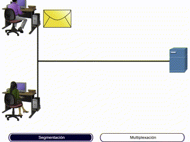
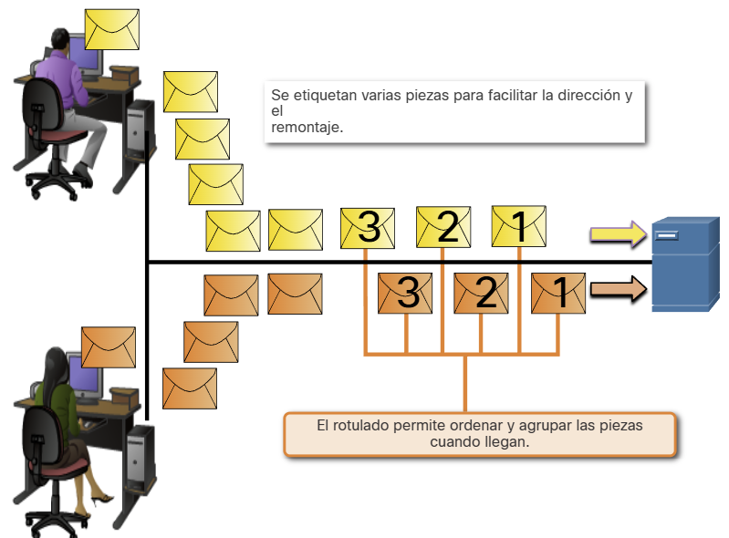
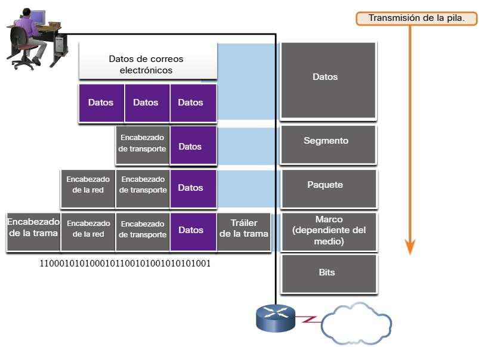
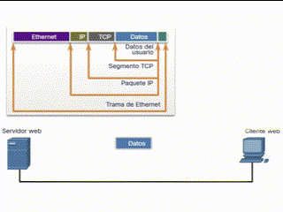
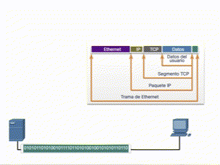

## 3.6.1 Segmentación del mensaje

Conocer el modelo de referencia OSI y el modelo de protocolo TCP/IP será útil cuando aprenda acerca de cómo se encapsulan los datos a medida que se mueven a través de una red. No es tan simple como una carta física que se envía a través del sistema de correo.

En teoría, una comunicación simple, como un vídeo musical o un correo electrónico puede enviarse a través de la red desde un origen hacia un destino como una transmisión de bits masiva y continua. Sin embargo, esto crearía problemas para otros dispositivos que necesitan utilizar los mismos canales de comunicación o enlaces. Estas grandes transmisiones de datos originarán retrasos importantes. Además, si falla un enlace en la infraestructura de la red interconectada durante la transmisión, el mensaje completo se perdería y tendría que retransmitirse completamente.

Un método mejor es dividir los datos en partes más pequeñas y manejables para enviarlas por la red. La segmentación es el proceso de dividir un flujo de datos en unidades más pequeñas para transmisiones a través de la red. La segmentación es necesaria porque las redes de datos utilizan el conjunto de protocolos TCP/IP para enviar datos en paquetes IP individuales. Cada paquete se envía por separado, similar al envío de una carta larga como una serie de postales individuales. Los paquetes que contienen segmentos para el mismo destino se pueden enviar a través de diferentes rutas.

La segmentación de mensajes tiene dos beneficios principales.

* **Aumenta la velocidad** - Debido a que un flujo de datos grande se segmenta en paquetes, se pueden enviar grandes cantidades de datos a través de la red sin atar un enlace de comunicaciones. Esto permite que muchas conversaciones diferentes se intercalen en la red llamada multiplexación.
* **Aumenta la eficiencia** - si un solo segmento no llega a su destino debido a una falla en la red o congestión de la red, solo ese segmento necesita ser retransmitido en lugar de volver a enviar toda la secuencia de datos.

<div style="text-align: center;">
    
</div>

## 3.6.2 Secuenciación

La desventaja de utilizar segmentación y multiplexión para transmitir mensajes a través de la red es el nivel de complejidad que se agrega al proceso. Supongamos que tuviera que enviar una carta de 100 páginas, pero en cada sobre solo cabe una. Por lo tanto, se necesitarían 100 sobres y cada sobre tendría que dirigirse individualmente. Es posible que la carta de 100 páginas en 100 sobres diferentes llegue fuera de pedido. En consecuencia, la información contenida en el sobre tendría que incluir un número de secuencia para garantizar que el receptor pudiera volver a ensamblar las páginas en el orden adecuado.

En las comunicaciones de red, cada segmento del mensaje debe seguir un proceso similar para asegurar que llegue al destino correcto y que puede volverse a ensamblar en el contenido del mensaje original, como se muestra en la figura 2. TCP es responsable de secuenciar los segmentos individuales.



## 3.6.3 Unidades de datos de protocolo

Mientras los datos de la aplicación bajan a la pila del protocolo y se transmiten por los medios de la red, se agrega diversa información de protocolos en cada nivel. Esto comúnmente se conoce como proceso de encapsulamiento.

**Nota:** Aunque la PDU UDP se denomina datagrama, los paquetes IP a veces también se conocen como datagramas IP.

La manera que adopta una porción de datos en cualquier capa se denomina unidad de datos del protocolo (PDU). Durante el encapsulamiento, cada capa encapsula las PDU que recibe de la capa inferior de acuerdo con el protocolo que se utiliza. En cada etapa del proceso, una PDU tiene un nombre distinto para reflejar sus funciones nuevas. Aunque no existe una convención universal de nombres para las PDU, en este curso se denominan de acuerdo con los protocolos de la suite TCP/IP. Las PDU de cada tipo de datos se muestran en la figura.



_Datos: término general que se utiliza en la capa de aplicación para la PDU_
_Segmento: PDU de la capa de transporte_
_Paquete: PDU de la capa de red_
_Trama: PDU de la capa de enlace de datos_
_Bits: PDU de capa física que se utiliza cuando se transmiten datos físicamente por el medio_
_Nota: Si el encabezado de transporte es TCP, entonces es un segmento. Si el encabezado de transporte es UDP, entonces es un datagrama._

## 3.6.4 Ejemplo de encapsulamiento

Cuando se envían mensajes en una red, el proceso de encapsulamiento opera desde las capas superiores hacia las capas inferiores. En cada capa, la información de la capa superior se considera como datos en el protocolo encapsulado. Por ejemplo, el segmento TCP se considera como datos en el paquete IP.

Usted vio esta animación anteriormente en este módulo. Esta vez, haga clic en Reproducir y concéntrese en el proceso de encapsulación ya que un servidor web envía una página web a un cliente web.

<div style="text-align: center;">
    
</div>

## 3.6.5 Ejemplo de desencapsulamiento

Este proceso se invierte en el host receptor, y se conoce como desencapsulamiento. El desencapsulamiento es el proceso que utilizan los dispositivos receptores para eliminar uno o más de los encabezados de protocolo. Los datos se desencapsulan mientras suben por la pila hacia la aplicación del usuario final.

Usted vio esta animación anteriormente en este módulo. Esta vez, haga clic en Reproducir y concéntrese en el proceso de desencapsulación.

<div style="text-align: center;">
    
</div>

## 3.6.6 Verifique su comprensión - Protección de datos

Verifique su comprensión de la encapsulación de datos eligiendo la MEJOR respuesta a las siguientes preguntas.

**Pregunta 1**
¿Cuál es el proceso de dividir un flujo de datos grande en trozos más pequeños antes de la transmisión?

- [ ] Secuenciación
- [ ] Dúplex
- [ ] Multiplexación
- [x] Segmentación 

**Pregunta 2**
¿Cuál de las siguientes es la PDU asociada a la capa de transporte?

- [x] Segmento - [ ] Paquete
- [ ] Bits
- [ ] Trama

**Pregunta 3**
¿Qué capa de pila de protocolo encapsula los datos en tramas?

- [x] Enlace de datos - [ ] Transporte
- [ ] Red
- [ ] Aplicación

**Pregunta 4**
¿Cuál es el nombre del proceso de agregar información de protocolo a los datos a medida que se mueve hacia abajo en la pila de protocolos?

- [ ] Desencapsulamiento
- [ ] Secuenciación
- [ ] Segmentación
- [x] Encapsulamiento ```