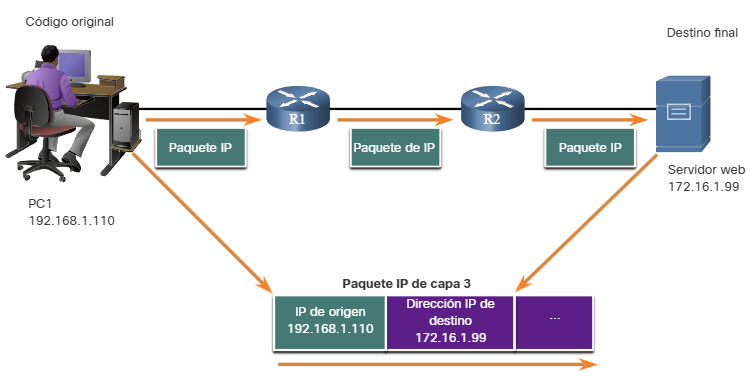
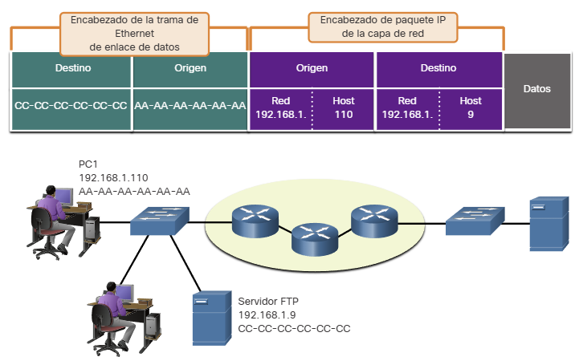
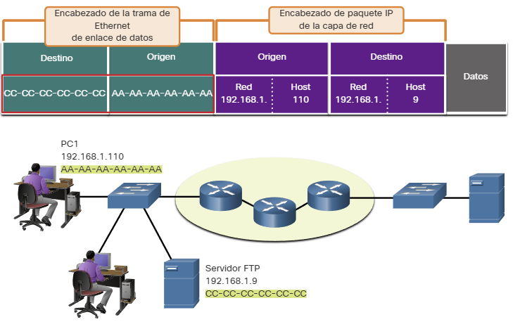
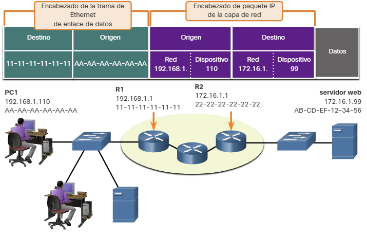
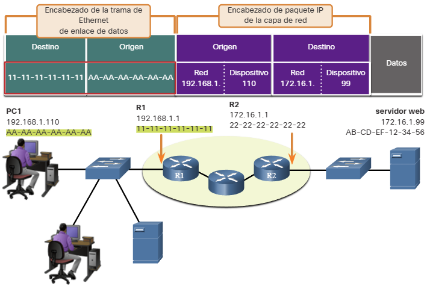
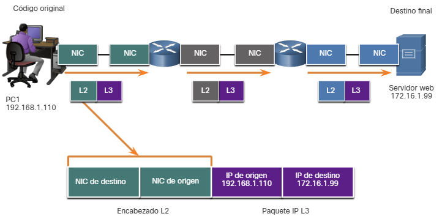
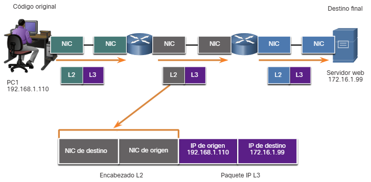
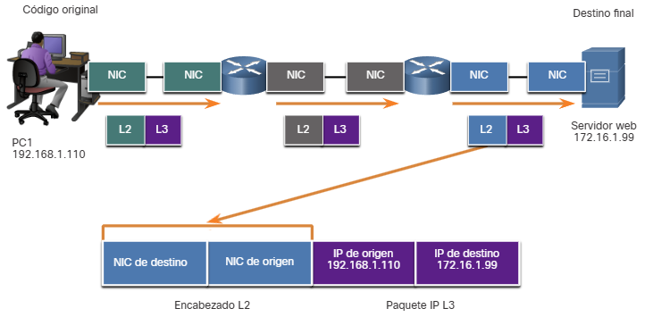

## 3.7.1 Direcciones

Como acaba de aprender, es necesario segmentar los mensajes en una red. Pero esos mensajes segmentados no irán a ninguna parte si no se abordan correctamente. En este tema se ofrece una descripción general de las direcciones de red. También tendrá la oportunidad de usar la herramienta Wireshark, que le ayudará a 'ver' el tráfico de la red.

La capa de red y la capa de enlace de datos son responsables de enviar los datos desde el dispositivo de origen o emisor hasta el dispositivo de destino o receptor. Como se muestra en la figura 1, los protocolos de las dos capas contienen las direcciones de origen y de destino, pero sus direcciones tienen objetivos distintos.

**Direcciones de origen y de destino de la capa de red:** son responsables de enviar el paquete IP desde el dispositivo de origen hasta el dispositivo final, ya sea en la misma red o a una red remota.
**Direcciones de origen y de destino de la capa de enlace de datos:** son responsables de enviar la trama de enlace de datos desde una tarjeta de interfaz de red (NIC) a otra en la misma red.

| Capa del modelo OSI | Función                                      |
|---------------------|----------------------------------------------|
| 1 - Física          | Bits de temporización y sincronización       |
| 2 - Enlace de datos | Direcciones físicas de destino y origen      |
| 3 - Red             | Direcciones de red lógica de destino y origen |
| 4 - Transporte      | Número de proceso de destino y de origen (puertos) |
| 5 - Capas superiores| Datos codificados de aplicación              |

## 3.7.2 Dirección lógica de capa 3

Una dirección lógica de la capa de red, o capa 3, se utiliza para enviar el paquete IP desde el dispositivo de origen hasta el dispositivo de destino, como se muestra en la figura.

Los paquetes IP contienen dos direcciones IP:

**Dirección IP de origen:** la dirección IP del dispositivo emisor, la fuente de origen del paquete.
**Dirección IP de destino:** la dirección IP del dispositivo receptor, es decir, el destino final del paquete.

Las direcciones de la capa de red, o direcciones IP, indican el origen y el destino final. Esto es cierto si el origen y el destino están en la misma red IP o redes IP diferentes.

Un paquete IP contiene dos partes:

**Porción de red (IPv4) o Prefijo (IPv6):** la sección más a la izquierda de la dirección que indica la red de la que es miembro la dirección IP. Todos los dispositivos de la misma red tienen la misma porción de red de la dirección.
**Porción de host (IPv4) o ID de interfaz (IPv6):** la parte restante de la dirección que identifica un dispositivo específico de la red. La sección de host es única para cada dispositivo o interfaz en la red.

**Nota:** La máscara de subred (IPv4) o la longitud del prefijo (IPv6) se utiliza para identifica la porción de red de una dirección IP de la porción del host.

## 3.7.3 Dispositivos en la misma red

En este ejemplo, tenemos un equipo cliente, PC1, que se comunica con un servidor FTP, en la misma red IP.

**Dirección IPv4 de origen:** la dirección IPv4 del dispositivo emisor, es decir, el equipo cliente PC1: 192.168.1.110.
**Dirección IPv4 de destino:** la dirección IPv4 del dispositivo receptor, el servidor FTP: 192.168.1.9.

En la figura, observe que la porción de red de las direcciones IP de origen y de destino se encuentran en la misma red. Observe en la figura que la parte de red de la dirección IPv4 de origen y la parte de red de la dirección IPv4 de destino son iguales y, por tanto, el origen y el destino están en la misma red.

## 3.7.4 Función de las direcciones de la capa de enlace de datos - La misma red IP

Cuando el emisor y el receptor del paquete IP están en la misma red, la trama de enlace de datos se envía directamente al dispositivo receptor. En una red Ethernet, las direcciones de enlace de datos se conocen como direcciones de Control de acceso a medios de Ethernet (MAC), como se resalta en la figura.

Las direcciones MAC están integradas físicamente a la NIC Ethernet.

**Dirección MAC de origen:** la dirección de enlace de datos, o la dirección MAC de Ethernet, del dispositivo que envía la trama de enlace de datos con el paquete IP encapsulado. La dirección MAC de la NIC Ethernet de PC1 es AA-AA-AA-AA-AA-AA, redactada en notación hexadecimal.
**Dirección MAC de destino:** cuando el dispositivo receptor está en la misma red que el dispositivo emisor, la dirección MAC de destino es la dirección de enlace de datos del dispositivo receptor. En este ejemplo, la dirección MAC de destino es la dirección MAC del servidor FTP: CC-CC-CC-CC-CC-CC, escrito en notación hexadecimal.

La trama con el paquete IP encapsulado ahora se puede transmitir desde PC1 directamente hasta el servidor FTP.

## 3.7.5 Dispositivos en una red remota

Sin embargo, ¿cuáles son las funciones de la dirección de la capa de red y de la dirección de la capa de enlace de datos cuando un dispositivo se comunica con un otro en una red remota? En este ejemplo, tenemos un equipo cliente, PC1, que se comunica con un servidor, en este caso un servidor web, en una red IP diferente.

## 3.7.6 Función de las direcciones de la capa de red

Cuando el emisor del paquete se encuentra en una red distinta de la del receptor, las direcciones IP de origen y de destino representan los hosts en redes diferentes. Esto lo indica la porción de red de la dirección IP del host de destino.

**Dirección IPv4 de origen:** la dirección IPv4 del dispositivo emisor, es decir, el equipo cliente PC1: 192.168.1.110.
**Dirección IPv4 de destino:** la dirección IPv4 del dispositivo receptor, es decir, el servidor web: 172.16.1.99.

En la figura, observe que la porción de red de las direcciones IP de origen y de destino se encuentran en redes diferentes.

## 3.7.7 Rol de acceso a datos de las direcciones de capa de vínculo de datos - Diferentes redes IP

Cuando el emisor y el receptor del paquete IP se encuentran en redes diferentes, la trama de enlace de datos de Ethernet no se puede enviar directamente al host de destino, debido a que en la red del emisor no se puede tener acceso directamente al host. La trama de Ethernet se debe enviar a otro dispositivo conocido como router o gateway predeterminado. En nuestro ejemplo, el gateway predeterminado es R1. R1 tiene una dirección de enlace de datos de Ethernet que se encuentra en la misma red que PC1. Esto permite que PC1 alcance el router directamente.

**Dirección MAC de origen:** la dirección MAC de Ethernet del dispositivo emisor, PC1. La dirección MAC de la interfaz Ethernet de PC1 es AA-AA-AA-AA-AA-AA.
**Dirección MAC de destino:** cuando el dispositivo receptor, la dirección IP de destino, está en una red distinta de la del dispositivo emisor, este utiliza la dirección MAC de Ethernet del gateway predeterminado o el router. En este ejemplo, la dirección MAC de destino es la dirección MAC de la interfaz Ethernet de R1, 11-11-11-11-11-11. Esta es la interfaz que está conectada a la misma red que PC1, como se muestra en la figura.

La trama de Ethernet con el paquete IP encapsulado ahora se puede transmitir a R1. R1 reenvía el paquete al destino, el servidor web. Esto puede significar que R1 reenvía el paquete a otro router o directamente al servidor web si el destino se encuentra en una red conectada a R1.

Es importante que en la dirección IP del gateway predeterminado esté configurada en cada host de la red local. Todos los paquetes que tienen como destino redes remotas se envían al gateway predeterminado. Las direcciones MAC de Ethernet y el gateway predeterminado se analizan en capítulos más adelante.

## 3.7.8 Direcciones de enlace de datos

La dirección física de la capa de enlace de datos, o capa 2, tiene una función distinta. Su propósito es enviar la trama de enlace de datos desde una interfaz de red hasta otra interfaz de red en la misma red.

Antes de que un paquete IP pueda enviarse a través de una red conectada por cable o inalámbrica, se debe encapsular en una trama de enlace de datos de modo que pueda transmitirse a través del medio físico.

**Host a enrutador**

**Enrutador a enrutador**

**Enrutador a servidor**

A medida que el paquete IP se mueve de host a router, de router a router y, finalmente, de router a host, es encapsulado en una nueva trama de enlace de datos, en cada punto del recorrido. Cada trama de enlace de datos contiene la dirección de origen de enlace de datos de la tarjeta NIC que envía la trama y la dirección de destino de enlace de datos de la tarjeta NIC que recibe la trama.

El protocolo de enlace de datos de capa 2 solo se utiliza para enviar el paquete de NIC a NIC en la misma red. El router elimina la información de la capa 2 a medida que una NIC la recibe y agrega nueva información de enlace de datos antes de reenviarla a la NIC de salida en su recorrido hacia el dispositivo de destino final.

El paquete IP se encapsula en una trama de enlace de datos que contiene información de enlace de datos, como la siguiente:

**Dirección de enlace de datos de origen:** la dirección física de la NIC del dispositivo que envía la trama de enlace de datos.
**Dirección de enlace de datos de destino:** la dirección física de la NIC que recibe la trama de enlace de datos. Esta dirección es el router del salto siguiente o el dispositivo de destino final.

## 3.7.11 Ponga a prueba su conocimiento - Acceso de datos

Verifique su comprensión de la encapsulación de datos eligiendo la MEJOR respuesta a las siguientes preguntas.

**Pregunta 1**
¿Verdadero o falso? Las tramas intercambiadas entre dispositivos de diferentes redes IP deben reenviarse a una puerta de enlace predeterminada.

- [x] Verdadero
- [ ] Falso

**Pregunta 2**
¿Verdadero o falso? La parte más derecha de una dirección IP se utiliza para identificar la red a la que pertenece un dispositivo.

- [ ] Verdadero
- [x] Falso

**Pregunta 3**
¿Qué se utiliza para determinar las porciones de red y host de una dirección IPv4?

- [x] Máscara de subred
- [ ] Dirección MAC
- [ ] Parte más derecha de la dirección IP
- [ ] Parte más a la izquierda de la dirección MAC

**Pregunta 4**
¿Cuáles de las siguientes instrucciones son verdaderas con respecto a las direcciones de capa de red y capa de enlace de datos? (Escoja tres opciones.)

- [ ] Las direcciones de capa de vínculo de datos son lógicas y las direcciones de capa de red son físicas.
- [ ] Las direcciones de capa de red se expresan como 12 dígitos hexadecimales y las direcciones de capa de vínculo de datos son decimales.
- [x] Las direcciones de capa de red son lógicas y las direcciones de enlace de datos se expresan como 12 dígitos hexadecimales.
- [x] Las direcciones de capa de vínculo de datos son físicas y las direcciones de capa de red son lógicas.
- [x] Las direcciones de capa de red tienen 32 o 128 bits de longitud.
- [ ] Las direcciones de capa de enlace de datos tienen 32 bits de longitud.

**Pregunta 5**
¿Cuál es el orden de las dos direcciones en el marco de enlace de datos?

- [x] MAC de origen a MAC de destino
- [ ] MAC de destino, IP de origen
- [ ] IP de destino, IP de origen
- [ ] MAC de destino a MAC de origen
- [ ] IP de origen a IP de destino

**Pregunta 6**
¿Verdadero o falso? Las direcciones de vínculo de datos son físicas, por lo que nunca cambian en el marco de vínculo de datos de origen a destino.

- [ ] Verdadero
- [x] Falso